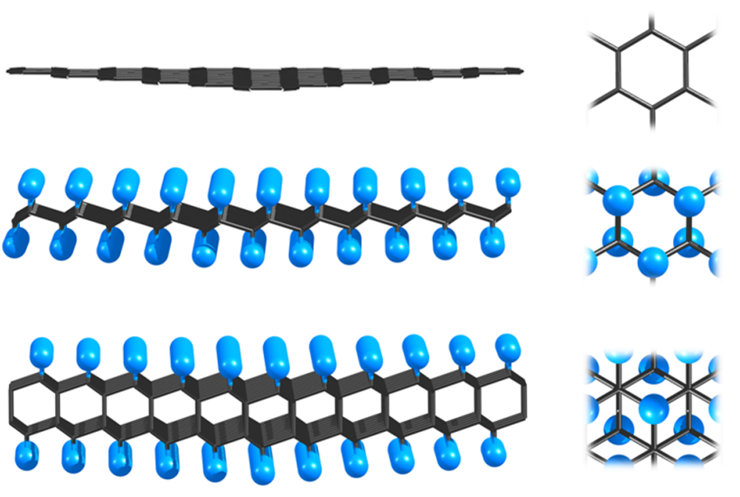
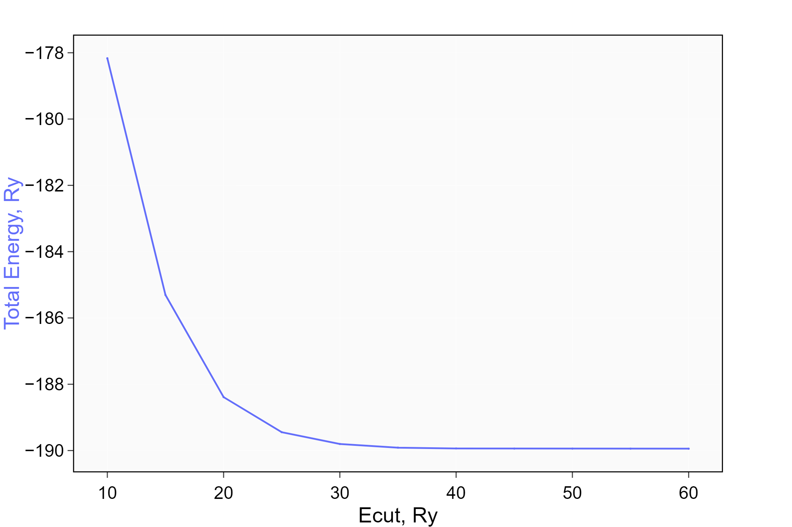
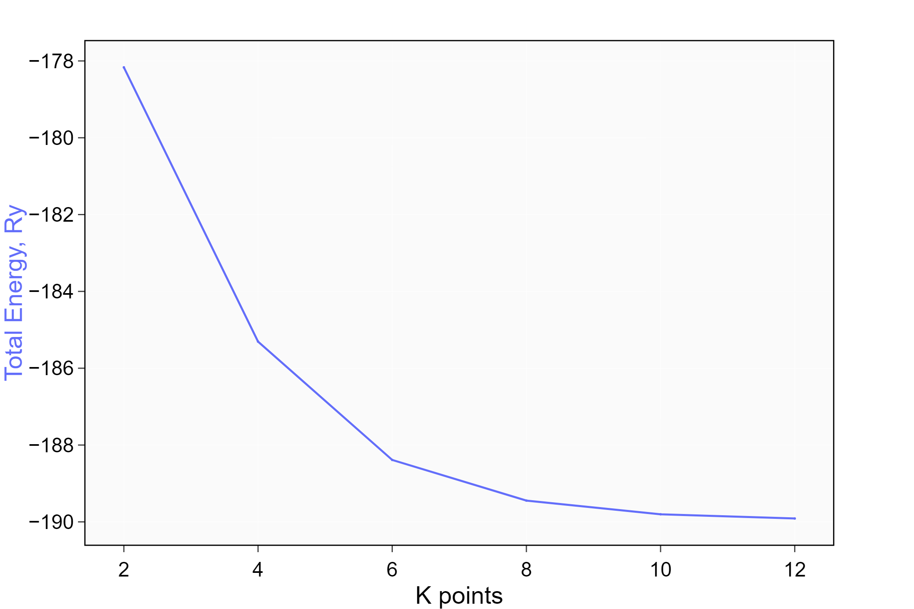
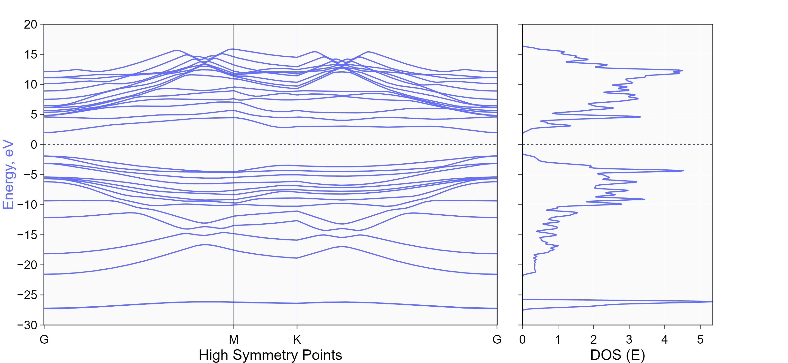

# QE Calculation of Diamane properties
## Introduction
> 2D materials are becoming more promising materials for the next generation of (opto-)electronic devices and other high-tech applications due to their unique electronic and optical properties. Although 2D materials hold great promise for electronics, optical and quantum devices, there are still several challenges that need to be addressed to fully realize their potential. Research in this area will help find materials with the desired properties for various applications.  

> First predicted in 2009, diamane is a bilayer sp2 hybridized graphene that transforms into an sp3 hybridized structure by forming a covalent bond. Two atoms are incorporated with hydrogen (or fluorine) atoms defining the C2H structure and, when combined with another layer of carbons, form a covalent bond, thereby leading to the formation of a new structure called diamane and shown in Figure.  

## Optimization parameters

> **1.OPT.energy**

- Conducted convergence of Energy over cut-off energy `ecutwfc` in a range 10-60 Ry  
- `45 Ry` ecutwfc is chosen, because further the energy is changed in range lower than 1 mRy

> **1.OPT.kpoints**

- Conducted convergence of Energy over k-points grid `KPOINTS` in a range 2-12  
- `12 12 1` k-points grid is chosen, because further the energy is changed in range lower than 1 Ry

## Relaxation

> **2.Relaxation**

- **vc-relax** is used to relax ATOMIC POSITIONS and CELL PARAMETERS
- Relaxed CELL PARAMETERS are used for Self-Consistent Field (SCF) calculations

## Electronic Density of States (DOS) and Band Structure
> **3.eDOS**
> **4.eBANDS**
- Fermi Energy = 
- Band Gap = 3.9107 eV

## Mechanical Properties

